<div align="center">

# 🚀 **CRESRA** 
### *Leading Custom Software Development Company*


[](https://cresra.com)
[](https://cresra.com)
[](https://cresra.com)
[](https://cresra.com)

---

</div>

## 🎯 **About Cresra**

> *Cresra is a leading custom software development company that specializes in creating **scalable web applications**, **cross-platform mobile applications**, **advanced artificial intelligence solutions**, and **robust cloud infrastructures**. Our unwavering commitment to innovation and precision enables us to deliver impactful solutions that drive business growth.*

```mermaid
mindmap
  root((🚀 CRESRA))
    🌐 Web Development
      React.js
      Next.js
      Node.js
    📱 Mobile Apps
      Flutter
      React Native
      Swift/Kotlin
    🤖 AI/ML
      TensorFlow
      PyTorch
      OpenAI APIs
    ☁️ Cloud & DevOps
      AWS
      Azure
      Kubernetes
    📊 Data Engineering
      ETL Pipelines
      Analytics
      BI Dashboards
    ⛓️ Blockchain
      Smart Contracts
      DApps
      Web3
```

<div align="center">



</div>

---

## 👥 **Our Expert Team**

Our team of **full-stack developers**, **cloud architects**, and **AI specialists** transforms business ideas into market-ready software. From enterprise back‑ends to intuitive user interfaces, from predictive analytics to automated workflows, every line of code reflects our commitment to excellence, and every deployment drives measurable growth.

<div align="center">

| 🎯 **Role** | 🔧 **Expertise** | 📈 **Impact** |
|-------------|------------------|---------------|
| 💻 **Full-Stack Developers** | End-to-end application development | 🚀 **Rapid Delivery** |
| ☁️ **Cloud Architects** | Scalable infrastructure design | 📊 **99.9% Uptime** |
| 🤖 **AI Specialists** | Intelligent automation solutions | ⚡ **Process Optimization** |
| 🛡️ **Security Engineers** | Enterprise-grade security | 🔒 **Zero Breaches** |

</div>

---

## 🎯 **Our Mission**

<div align="center">

> ### *Empowering organizations with cutting‑edge software, web, and mobile applications, and cloud solutions that adapt and scale as their needs evolve.*

</div>

---

## 🛠️ **Core Capabilities**

<details open>
<summary><b>🏢 Custom Software Development</b></summary>

```
██████████████████████████████████████████████████ 100%
Enterprise‑grade systems designed for security, performance, and extensibility.
```

- **🔐 Security**: Enterprise-grade security protocols
- **⚡ Performance**: Optimized for speed and efficiency  
- **🔧 Extensibility**: Built to grow with your business
</details>

<details open>
<summary><b>🌐 Web & Mobile Applications</b></summary>

```
█████████████████████████████████████████████████░ 98%
Responsive, high‑performance experiences across all platforms.
```

**Frontend Technologies:**
- 
- 
- 
- 
- 
- 
</details>

<details open>
<summary><b>🤖 AI & Machine Learning</b></summary>

```
████████████████████████████████████████████████░░ 96%
Intelligent solutions powered by cutting-edge AI technologies.
```

**AI/ML Stack:**
- 
- 
- 

**Capabilities:**
- 👁️ Computer Vision
- 🗣️ Natural Language Processing  
- 🎯 Recommendation Engines
</details>

<details open>
<summary><b>☁️ Cloud Infrastructure & DevOps</b></summary>

```
███████████████████████████████████████████████░░░ 94%
Automated, scalable, and secure cloud deployments.
```

**Cloud Platforms:**
- 
- 
- 
- 
</details>

<details open>
<summary><b>📊 Data Engineering & BI</b></summary>

```
██████████████████████████████████████████████░░░░ 92%
End‑to‑end data solutions for informed decision‑making.
```

- 🔄 **ETL Workflows** - Seamless data transformation
- 📈 **Analytics Dashboards** - Real-time insights
- 🗃️ **Data Pipelines** - Automated processing
</details>

<details open>
<summary><b>⛓️ Blockchain Development</b></summary>

```
█████████████████████████████████████████░░░░░░░░░ 85%
Decentralized solutions for enhanced trust and transparency.
```

- 📝 **Smart Contracts** - Automated agreements
- 🌐 **DApps** - Decentralized applications
- 🔗 **Web3 Integration** - Future-ready solutions
</details>

---

## 🏆 **Why Choose Cresra?**

<div align="center">

<table>
<tr>
<td align="center" width="25%">

<br><b>🎖️ Certified Professionals</b>
<br><small>AWS, Kubernetes & Data Engineering</small>
</td>
<td align="center" width="25%">

<br><b>🚀 Agile Methodologies</b>
<br><small>Rapid delivery & continuous improvement</small>
</td>
<td align="center" width="25%">

<br><b>📊 Proven Track Record</b>
<br><small>Performance, scalability & security</small>
</td>
<td align="center" width="25%">

<br><b>💫 Innovation First</b>
<br><small>Cutting-edge technologies</small>
</td>
</tr>
</table>

</div>

---

## 📈 **Our Success Metrics**

<div align="center">

```
📊 Project Success Rate          ████████████████████ 99.2%
⚡ Average Delivery Time         ███████████████░░░░░ 2.3 weeks
🔒 Security Incidents           ████████████████████ 0 incidents
🚀 Client Satisfaction         ██████████████████░░ 98.5%
```

</div>

---

## 🤝 **Partnership Philosophy**

<div align="center">

> ### 🎯 **Your Ambition, Our Engineering.**  
> ### 🚀 **Unstoppable Together.**

*We don't just build software; we build partnerships that last. Every project is a collaborative journey toward digital excellence.*

</div>

---

## 🌐 **Get Started Today**

<div align="center">

[](https://cresra.com)
[](https://cresra.com/contact)
[](https://cresra.com/portfolio)

### 📍 **Ready to transform your vision into reality?**
*Let's discuss your next breakthrough project.*

---


**© 2025 Cresra - Transforming Ideas Into Digital Excellence**

</div>
